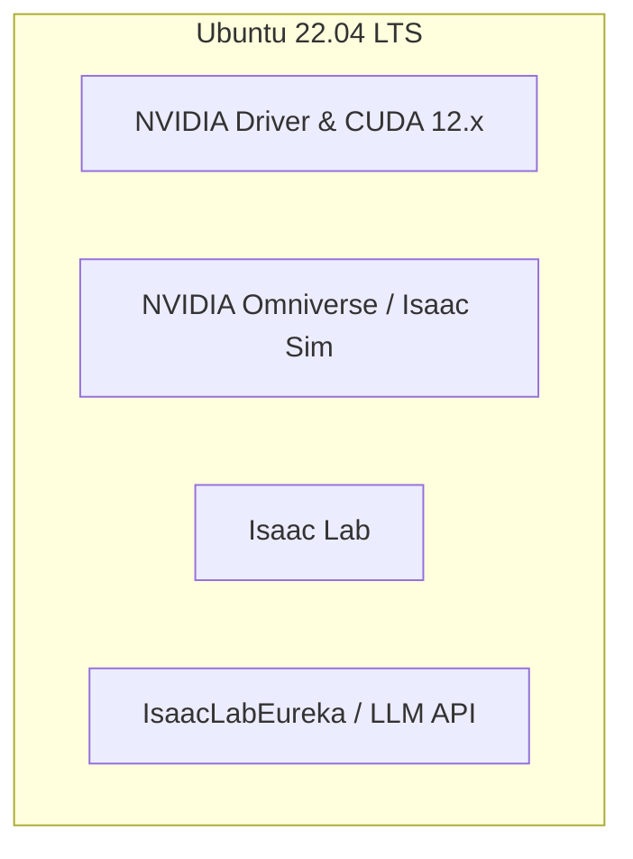

# 学習環境・シミュレーション環境構築手順書 (Ubuntu環境向け)

本手順書は、**NVIDIA GPU (RTXシリーズ) および CUDA** を搭載した **Ubuntu** 環境上で、NVIDIA Isaac Sim、Isaac Lab、および IsaacLabEureka をネイティブに構築・実行する手順を解説します。

---

## 🏗️ 全体アーキテクチャ・前提条件



### 推奨環境スペック
*   **OS**: Ubuntu 22.04 LTS (推奨) または 20.04 LTS
*   **GPU**: NVIDIA RTX 3080/4080 以上、またはデータセンター向けGPU (A10G, L4, A100 など)
*   **ドライバ**: NVIDIA Driver 535 以上
*   **APIキー**: OpenAI, Gemini などのクラウドLLM APIキー、またはローカルLLM (Ollama等)

---

## 🛠️ 環境構築ステップ

### ステップ 1: NVIDIA ドライバ & Docker の基本セットアップ

GPUをシミュレータから利用できるようにするために、最新のドライバと Docker Container Toolkit をインストールします。

```bash
# 1. パッケージリストの更新
sudo apt update && sudo apt upgrade -y

# 2. NVIDIA ドライバのインストール (推奨バージョン: 535)
sudo apt install nvidia-driver-535 -y
# ※インストール後、マシンを再起動してください (sudo reboot)

# 3. インストールの確認 (GPU情報が表示されればOK)
nvidia-smi

# 4. NVIDIA Container Toolkit のセットアップ (DockerでGPUを使うため)
curl -fsSL https://nvidia.github.io/libnvidia-container/gpgkey | sudo gpg --dearmor -o /usr/share/keyrings/nvidia-container-toolkit-keyring.gpg
curl -s -L https://nvidia.github.io/libnvidia-container/stable/deb/nvidia-container-toolkit.list | \
  sed 's#deb https://#deb [signed-by=/usr/share/keyrings/nvidia-container-toolkit-keyring.gpg] https://#g' | \
  sudo tee /etc/apt/sources.list.d/nvidia-container-toolkit.list
sudo apt update
sudo apt install -y nvidia-container-toolkit

# Dockerを再起動
sudo systemctl restart docker
```

---

### ステップ 2: NVIDIA Omniverse & Isaac Sim のインストール (Docker版)

ヘッドレス（GUI画面なし）での高速強化学習を想定し、最も標準的な Docker 方式でインストールします。

```bash
# 1. NGC (NVIDIA GPU Cloud) から Isaac Sim Dockerイメージ of 取得
# ※事前にNGCアカウントの作成とAPIキーの発行が必要です
docker login nvcr.io
# Username: $oauthtoken
# Password: <YOUR_NGC_API_KEY>

# Isaac Simの最新イメージのプル (例: 4.0.0)
docker pull nvcr.io/nvidia/isaac-sim:4.0.0
```

---

### ステップ 3: Isaac Lab のインストールと動作確認

Isaac Labは、Isaac Simの上で動作する強化学習用フレームワークです。

```bash
# 1. リポジトリのクローン
git clone https://github.com/isaac-sim/IsaacLab.git
cd IsaacLab

# 2. Isaac Simのパスを設定 (Docker起動スクリプトや .bashrc に以下を設定します)
export ISAACSIM_PATH="/opt/nvidia/omniverse/isaac-sim"

# 3. 依存関係のインストール (Isaac Labに同梱されているPython環境をセットアップ)
./isaaclab.sh --install

# 4. サンプルコードによる動作確認 (アームがランダムに動くかテスト)
./isaaclab.sh -p source/standalone/demos/arms.py --headless
```

---

### ステップ 4: Eureka (IsaacLabEureka) のクローンとライブラリ設定

最新のIsaac Labに対応した `IsaacLabEureka` をセットアップします。

```bash
# 1. リポジトリのクローン
git clone https://github.com/NVlabs/IsaacLabEureka.git
cd IsaacLabEureka

# 2. 必要なPythonライブラリを Isaac Lab 内のPython環境にインストール
../IsaacLab/isaaclab.sh -p -m pip install -r requirements.txt
```

---

## 🚀 動作テスト (Dry-Run)

環境が構築できたら、実際に強化学習を始める前に、LLMから報酬コードを取得してシミュレータを1回走らせる最小動作テストを行います。

```bash
# 例: ローカルのGemma2を利用し、報酬を1回生成させるテスト
export OPENAI_BASE_URL="http://localhost:11434/v1"
export OPENAI_API_KEY="ollama"

python eureka.py --task Isaac-Reach-Franka-v0 --num_iterations 1 --model gemma2:27b
```
`outputs/` ディレクトリ内にLLMが生成した `reward.py` が保存されれば、動作テストは**成功**です！
